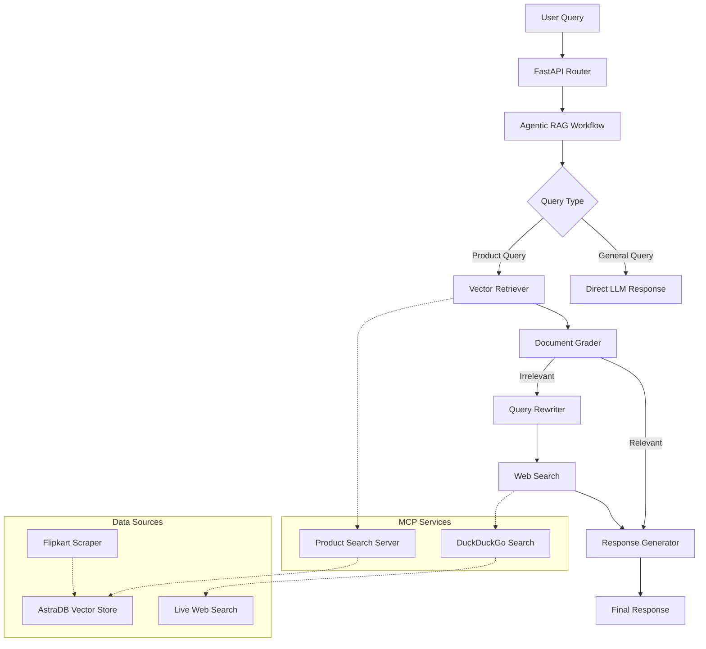

# 🛍️ ShopBuddy - AI-Powered E-Commerce Assistant

ShopBuddy is a production-ready, AI-powered e-commerce assistant built with **Agentic RAG architecture**, **Model Context Protocol (MCP) integration**, and **hybrid search capabilities**. It provides intelligent product recommendations, price comparisons, and customer support through natural language conversations.

## 🚀 Features

### 🧠 **Intelligent AI Architecture**
- **Agentic RAG Pipeline**: Self-routing workflow with autonomous decision-making
- **Hybrid Search System**: Vector similarity search with web search fallback
- **Multi-LLM Support**: Google Gemini, OpenAI GPT-4o, and Groq integration
- **Smart Query Routing**: Automatic detection of product vs. general queries

### 🔧 **Advanced Technical Capabilities**
- **Model Context Protocol (MCP)**: Industry-standard tool integration
- **Async Processing**: High-performance concurrent operations
- **Document Quality Grading**: Automatic relevance scoring with query rewriting
- **Contextual Compression**: LLM-powered document filtering
- **RAGAS Evaluation**: Context precision and response relevancy metrics

### 🌐 **Production-Ready Infrastructure**
- **Containerized Deployment**: Docker with multi-service orchestration
- **Kubernetes Support**: EKS cluster with auto-scaling
- **Cloud-Native Architecture**: AWS ECR integration
- **Secret Management**: Secure API key handling
- **Load Balancing**: High-availability traffic distribution

### 📊 **Data Pipeline**
- **Web Scraping**: Automated Flipkart product data extraction
- **Vector Storage**: AstraDB for semantic search
- **Real-time Updates**: Dynamic product information retrieval
- **Structured Logging**: JSON-based monitoring and debugging

## 🏗️ Architecture Overview



## 🛠️ Technology Stack

### **Backend & AI**
- **Python 3.11**: Core runtime environment
- **FastAPI**: High-performance web framework
- **LangChain**: LLM orchestration and chaining
- **LangGraph**: Agentic workflow management
- **RAGAS**: RAG evaluation metrics

### **AI Models & Services**
- **Google Gemini 2.0 Flash**: Primary LLM provider
- **OpenAI GPT-4o**: Alternative LLM option
- **Groq**: High-speed inference
- **Google Text-Embedding-004**: Vector embeddings

### **Data & Search**
- **AstraDB**: Vector database for semantic search
- **DuckDuckGo**: Web search integration
- **Selenium + BeautifulSoup**: Web scraping
- **Pandas**: Data processing

### **Infrastructure & DevOps**
- **Docker**: Containerization
- **Kubernetes**: Container orchestration
- **AWS EKS**: Managed Kubernetes service
- **AWS ECR**: Container registry
- **CloudFormation**: Infrastructure as Code

### **Monitoring & Logging**
- **Structlog**: Structured JSON logging
- **Custom Exception Handling**: Comprehensive error tracking
- **Health Checks**: Container monitoring

## 🚀 Quick Start

### Prerequisites
- Python 3.11+
- Docker & Docker Compose
- AWS CLI (for cloud deployment)
- kubectl (for Kubernetes deployment)

### 1. **Local Development Setup**

```bash
# Clone the repository
git clone https://github.com/yourusername/shopbuddy.git
cd shopbuddy

# Create virtual environment
python -m venv venv
source venv/bin/activate  # On Windows: venv\Scripts\activate

# Install dependencies
pip install -r requirements.txt

# Set up environment variables
cp .env.copy .env
# Edit .env with your API keys
```

### 2. **Environment Variables**

Create a `.env` file with the following variables:

```env
# LLM API Keys
GOOGLE_API_KEY=your_google_api_key
OPENAI_API_KEY=your_openai_api_key
GROQ_API_KEY=your_groq_api_key

# AstraDB Configuration
ASTRA_DB_API_ENDPOINT=your_astra_db_endpoint
ASTRA_DB_APPLICATION_TOKEN=your_astra_db_token
ASTRA_DB_KEYSPACE=your_keyspace

```

### 3. **Data Setup**

```bash
# Run the scraper UI to collect product data
streamlit run scrapper_ui.py

```

### 4. **Local Development**

```bash
# Start the FastAPI server
uvicorn product_assistant.router.main:app --reload --host 0.0.0.0 --port 8000

# Start MCP server (in another terminal)
python product_assistant/mcp_servers/product_search_server.py

```

## 🐳 Docker Deployment

### **Build and Run with Docker**

```bash
# Build the Docker image
docker build -t product-assistant .

# Run the container
docker run -d -p 8000:8000 --name product-assistant product-assistant

```

## 🧪 Testing the Application

### **Web Interface**
1. Navigate to `http://localhost:8000`
2. Click the chat icon in the bottom-right corner
3. Ask questions like:
   - "What's the price of Samsung Galaxy S25?"
   - "Show me budget smartphones under ₹50,000"
   - "Compare iPhone 15 and Samsung S24"

## 📊 Key Workflows

### **1. Agentic RAG Pipeline**
```python
# Example usage
from product_assistant.workflow.agentic_rag_workflow import AgenticRAG

rag_agent = AgenticRAG()
response = rag_agent.run("What's the best budget smartphone?")
print(response)
```

### **2. MCP-Enhanced Workflow**
```python
# Async MCP workflow with web search fallback
from product_assistant.workflow.agentic_workflow_with_mcp_websearch import AgenticRAG

rag_agent = AgenticRAG()
await rag_agent.initialize()
response = await rag_agent.run("Latest iPhone 16 reviews")
print(response)
```

### **3. Data Scraping**
```python
# Scrape Flipkart products
from product_assistant.ETL.data_scrapper import FlipkartScraper

scraper = FlipkartScraper()
products = scraper.scrape_flipkart_products("Samsung Galaxy", max_products=5)
scraper.save_to_csv(products, "samsung_products.csv")
```

### **Environment-Specific Settings**
- **Local Development**: Uses `.env` file
- **Production**: Uses Kubernetes secrets or AWS ECS task definitions
- **Docker**: Environment variables passed via `-e` flags

### **Monitoring**
```python
# Built-in evaluation
from product_assistant.evaluation.ragas_eval import evaluate_context_precision, evaluate_response_relevancy

context_score = evaluate_context_precision(query, response, contexts)
relevancy_score = evaluate_response_relevancy(query, response, contexts)
```

## 📄 Project Structure

```
shopbuddy/
├── 📁 product_assistant/          # Main application package
│   ├── 📁 ETL/                    # Data extraction and processing
│   ├── 📁 config/                 # Configuration files
│   ├── 📁 evaluation/             # RAGAS evaluation metrics
│   ├── 📁 exception/              # Custom exception handling
│   ├── 📁 logger/                 # Structured logging
│   ├── 📁 mcp_servers/            # Model Context Protocol servers
│   ├── 📁 prompt_library/         # Prompt templates
│   ├── 📁 retriever/              # Vector retrieval logic
│   ├── 📁 router/                 # FastAPI routing
│   ├── 📁 utils/                  # Utility functions
│   └── 📁 workflow/               # Agentic workflows
├── 📁 infrastructure/             # AWS CloudFormation templates
├── 📁 k8/                        # Kubernetes manifests
├── 📁 templates/                 # HTML templates
├── 📁 data/                      # Product data CSV
├── 📄 Dockerfile                 # Container configuration
├── 📄 requirements.txt           # Python dependencies
├── 📄 pyproject.toml             # Project metadata
└── 📄 README.md                  # This file
```
